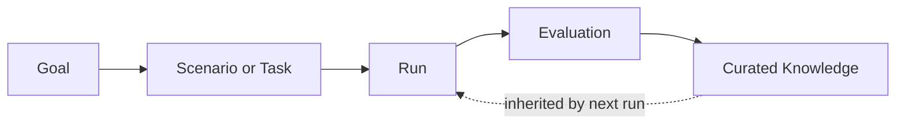

autocontext is a recursive self-improving harness. You give it a goal, it runs that goal as a concrete execution, evaluates the result, curates what is worth keeping, and feeds that curated knowledge back into the next run. Each pass starts from everything the last one learned rather than from scratch, so results compound over time.

## The cycle

The whole system is one loop. A goal is framed as a scenario or task, executed as a run, scored by an evaluator, and distilled into curated knowledge. The next run inherits that knowledge, so the starting point keeps improving.

The knowledge written at the end of one run (playbooks, hints, and lessons) is persisted per scenario and loaded back in at the start of the next run. That feedback edge is what makes re-running the same goal tend to do better, not just differently.

## The five roles

Within a run, the work is divided across five LLM agent roles that collaborate each generation:

- **Competitor** proposes strategies (the candidate work for the generation).
- **Analyst** explains what happened (findings, root causes, recommendations).
- **Coach** updates the playbook and hints carried forward.
- **Architect** proposes tooling improvements.
- **Curator** gates which knowledge is allowed to persist.

These roles, and how a run advances generation by generation through a backpressure gate, are covered in [The Generation Loop](/docs/concepts/the-loop).

## Where to go next

- [Scenarios, Tasks, Missions, Campaigns](/docs/concepts/scenarios-tasks): the four ways you frame work.
- [The Generation Loop](/docs/concepts/the-loop): the five roles and how a run advances.
- [Knowledge](/docs/concepts/knowledge): what persists across runs and how it is curated.
- [Runs, Traces, Artifacts](/docs/concepts/runs-traces-artifacts): the outputs a run produces and how to read them.
- [Evaluation](/docs/concepts/evaluation): how work is scored, with rubrics and tournaments.
