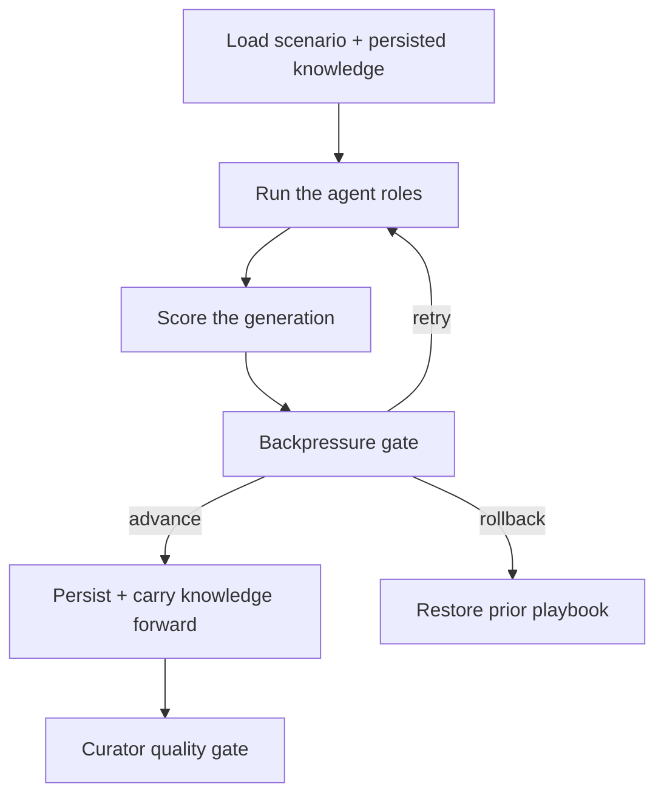

A run advances in discrete passes called generations. Each generation loads the scenario plus the knowledge persisted from earlier runs, orchestrates the agent roles to produce and analyze candidate work, scores it, and then decides whether the run should advance, retry, or roll back. The knowledge persisted from earlier runs is what makes each generation start ahead of the last.

## A generation, step by step

Each generation loads the scenario and accumulated knowledge, runs the competitor first, then the analyst, coach, and architect (in parallel), scores the result, applies the backpressure gate, and lets the curator decide what knowledge is allowed to persist. Lessons are periodically consolidated across generations.

## The five roles

- **Competitor** proposes strategies. It produces the candidate work for the generation (a JSON strategy, or executable code when code strategies are enabled).
- **Analyst** explains what happened. It produces a markdown analysis with findings, root causes, and recommendations.
- **Coach** updates the playbook and the hints carried into the next generation.
- **Architect** proposes tooling improvements, and can persist generated tools for the scenario.
- **Curator** is the quality gate. It decides which playbook updates and lessons are good enough to keep, and it periodically consolidates lessons.

The competitor runs first because the other roles react to what it produced. The analyst, coach, and architect then run together, and the curator gates the result.

## The backpressure gate

After a generation is scored, a backpressure gate decides how the run proceeds. It has three outcomes:

- **advance**: the generation improved enough, so the run moves forward and the playbook update persists.
- **retry**: the result was not a clear improvement, so the generation is attempted again rather than locked in.
- **rollback**: the result regressed, so the run restores a prior state instead of carrying a bad change forward.

Playbook updates only persist on `advance`, which keeps regressions from polluting the knowledge that future runs inherit.

## The curator quality gate

The backpressure gate decides whether a generation advances. The curator decides what knowledge survives. It acts as a quality gate over playbook updates and lessons, accepting, rejecting, or merging proposed changes, and consolidating lessons over time. This is the mechanism that keeps persisted [knowledge](/docs/concepts/knowledge) high-signal instead of letting every generation's output accumulate.
